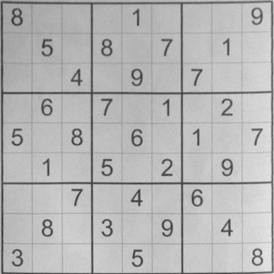
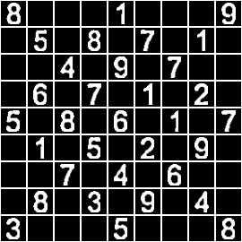
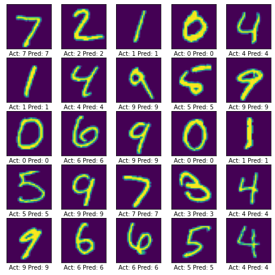

# Sudoku-Solver

Sudoku Solver using Convolution Neural Network and opencv. This project extract and solve the Sudoku puzzle from an image. Project is using opencv library for image processing and Convolutional Neural Network prediction of digits from image. Back tracking algorithm used solving Sudoku puzzle.

## Prerequisite

- Python opencv
- Tensorflow

## Working on opencv

`pip install opencv-python`

### Input image of Sudoku

### Cropped Image

### Extracted Image

## CNN Model for digit prediction
Keras MNIST dataset trained with CNN to build the model. 

** Accuracy of the model is 96% **

### Sample prediction from MNIST
